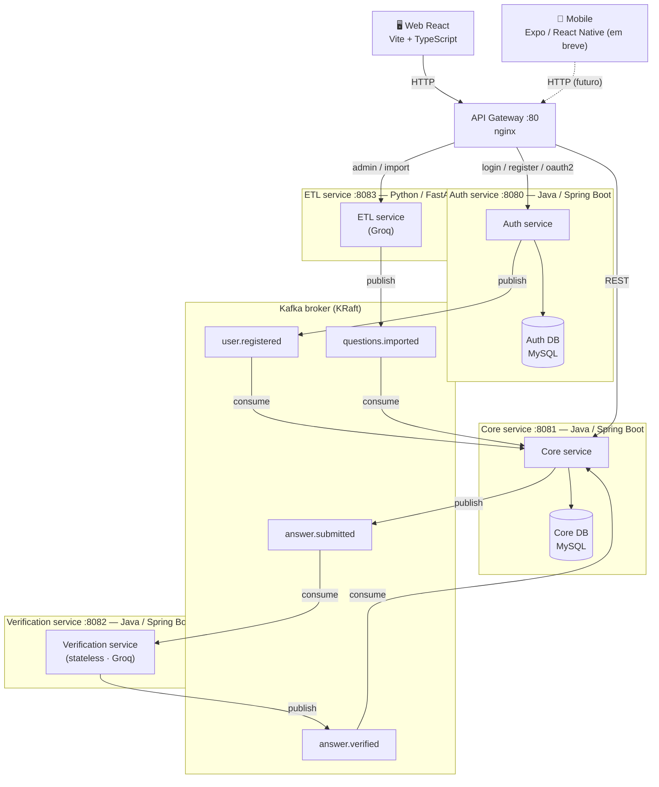

# CodeLab

Plataforma de estudos e prática de programação com feedback automatizado por IA, construída como estudo de arquitetura de microsserviços, comunicação assíncrona com Kafka, verificação de respostas com IA (Groq) e segurança com JWT.

---

## Arquitetura



> O **Web** também executa a checagem de `requiredUsage` (regex de `while`/`for`/`if`)
> localmente, como feedback instantâneo. A decisão final de aprovação é sempre da IA.

### Serviços

| Serviço | Linguagem | Porta | Responsabilidade |
|---|---|---|---|
| API Gateway | nginx | 80 | Ponto de entrada único, roteamento e CORS |
| Auth service | Java / Spring Boot | 8080 | Login, registro, OAuth2 Google, emissão/validação de JWT |
| Core service | Java / Spring Boot | 8081 | Questões, respostas, trilhas e gamificação (pontos/streak) |
| Verification service | Java / Spring Boot | 8082 | Consome `answer.submitted`, avalia com IA e publica o resultado |
| ETL service | Python / FastAPI | 8083 | Import/upload e extração de questões com IA |
| Web | React / Vite | 5173 | Interface principal (estudante/admin) |
| Mobile | Expo / React Native | — | Aplicativo mobile (em desenvolvimento) |

### Tópicos Kafka

| Tópico | Producer | Consumer | Descrição |
|---|---|---|---|
| `user.registered` | Auth service | Core service | Publicado no registro/login; Core cria o perfil/progresso inicial |
| `answer.submitted` | Core service | Verification service | Resposta + contexto da questão para avaliação |
| `answer.verified` | Verification service | Core service | Status (`APPROVED`/`AI_REJECTED`) e feedback da IA |
| `questions.imported` | ETL service | Core service | Lote de questões extraídas para persistência |

### Comunicação

- **Síncrona (REST):** Client ↔ Gateway ↔ Auth / Core / ETL
- **Assíncrona (Kafka):** Core → Kafka → Verification → Kafka → Core, e ETL → Kafka → Core

---

## Pré-requisitos

- [Docker](https://www.docker.com/) e Docker Compose
- [Node.js](https://nodejs.org/) 18+ (Web local e Mobile)
- [Python 3.12+](https://www.python.org/) (apenas para o ETL fora do Docker)
- Chave de API da [Groq](https://console.groq.com/) (verificação e extração com IA)

---

## Setup e execução

### 1. Clonar o repositório

```bash
git clone https://github.com/seu-usuario/CodeLab.git
cd CodeLab
```

### 2. Configurar variáveis de ambiente

O arquivo `.env` da raiz (já ignorado pelo git) precisa das credenciais. Preencha pelo menos `GROQ_API_KEY`, `GOOGLE_CLIENT_ID` e `GOOGLE_CLIENT_SECRET` — os demais têm padrão no `docker-compose.yml`:

```bash
cp .env.example .env
```

> Se `.env.example` não existir, crie o `.env` manualmente copiando o bloco da seção [Variáveis de ambiente](#vari%C3%A1veis-de-ambiente).

### 3. Subir todos os serviços

```bash
docker-compose up --build
```

A ordem de inicialização é gerenciada pelo `depends_on` do Compose:

```
Kafka (KRaft) → MySQL → Auth service → Core service → Verification service → ETL service → Gateway
```

### 4. Rodar o frontend Web (desenvolvimento)

O front roda fora do Docker e se conecta ao Gateway na porta 80.

```bash
cd CodelabWeb
npm install
npm run dev
```

### 5. Rodar o app Mobile (opcional)

```bash
cd CodeLabMobile
npm install
npx expo start
```

---

## Variáveis de ambiente

Todas as variáveis têm valores padrão no `docker-compose.yml`. Para customizar, use o `.env` na raiz:

```env
# MySQL
MYSQL_ROOT_PASSWORD=root
AUTH_DB_NAME=auth_db
CORE_DB_NAME=core_db

# Kafka
KAFKA_BROKER=kafka:9092

# JWT (HS256 — mesma secret no Auth e nos demais serviços)
JWT_SECRET=troque-por-uma-secret-longa-e-aleatoria
JWT_EXPIRATION=900

# Groq
GROQ_API_KEY=sua-chave-groq

# OAuth2 Google
GOOGLE_CLIENT_ID=dummy
GOOGLE_CLIENT_SECRET=dummy

# Frontend
FRONTEND_URL=http://localhost:5173

# Portas internas (não alterar sem atualizar o nginx.conf)
AUTH_SERVICE_PORT=8080
CORE_SERVICE_PORT=8081
VERIFICATION_SERVICE_PORT=8082
ETL_SERVICE_PORT=8083
```

---

## Endpoints

### Auth service (`/` via Gateway)

| Método | Rota | Auth | Descrição |
|---|---|---|---|
| POST | `/api/users/register` | — | Cria um novo usuário |
| GET | `/api/users/me` | ✓ | Retorna o usuário autenticado |
| PUT | `/api/users/perfil` | ✓ | Atualiza nome, e-mail ou senha |
| DELETE | `/api/users/perfil` | ✓ | Remove a própria conta |
| POST | `/api/users/upload-photo` | ✓ | Envia foto de perfil |
| GET | `/api/users` | adm | Lista todos os usuários |
| GET | `/oauth2/authorization/google` | — | Inicia o login com Google |

### Core service (`/` via Gateway)

| Método | Rota | Auth | Descrição |
|---|---|---|---|
| GET | `/questions` | ✓ | Lista questões |
| GET | `/questions/{id}` | ✓ | Busca questão por id |
| GET | `/questions/next?topic=` | ✓ | Próxima questão da trilha do usuário |
| POST | `/questions` | adm | Cria questão |
| PUT | `/questions/{id}` | adm | Atualiza questão |
| DELETE | `/questions/{id}` | adm | Remove questão |
| POST | `/answers` | ✓ | Envia resposta (`202` + `answerId`) |
| GET | `/answers/{id}` | ✓ | Consulta status da resposta (polling) |
| GET | `/answers/user/{id}` | ✓ | Respostas de um usuário |
| GET | `/api/trail/progress` | ✓ | Progresso do aluno na trilha |

### Verification service

| Método | Rota | Auth | Descrição |
|---|---|---|---|
| GET | `/health` | — | Saúde do serviço (sem API pública; atua por eventos) |

### ETL service (`/etl` via Gateway)

| Método | Rota | Auth | Descrição |
|---|---|---|---|
| POST | `/etl/import` | adm | Importa questões de um arquivo (upload) |
| POST | `/etl/import-text` | adm | Extrai questões a partir de texto puro |
| POST | `/etl/import-seed` | adm | Importa questões de um seed do classpath |

---

## Autenticação

O sistema usa **JWT** com assinatura **HS256** (secret compartilhada via variável de ambiente):

- **Access token** — emitido pelo Auth service no login/registro, usado em todas as requisições autenticadas
- Claims: `sub` (id), `email`, `role` (`ADMIN`/`USER`) e expiração

Inclua o token no header de todas as requisições protegidas:

```
Authorization: Bearer <access_token>
```

O Core service e o ETL service validam o token de forma **stateless**, sem consultar o Auth service. O login com Google redireciona de volta ao frontend com o token na URL de callback.

---

## Verificação de respostas

O fluxo de avaliação é assíncrono para não travar a requisição enquanto a IA processa:

1. O **Web** valida localmente o `requiredUsage` (`while`/`for`/`if`) — feedback imediato
2. `POST /answers` retorna `202 Accepted` com o `answerId` e status `PENDING`
3. O **Core** publica `answer.submitted` no Kafka
4. O **Verification service** consulta a IA (Groq) e publica `answer.verified`
5. O **Core** atualiza o status, os pontos e o streak do usuário
6. O **Web** faz polling em `GET /answers/{id}` até sair de `PENDING`

Status possíveis: `PENDING`, `APPROVED`, `AI_REJECTED`.

---

## Tolerância a falhas

- Se o **Verification service** cair, o Kafka retém `answer.submitted` e reprocessa quando o serviço voltar — o envio de respostas não é afetado
- O **Verification service** é stateless, permitindo escala horizontal
- O **Core service** é a fonte da verdade de questões, respostas e gamificação
- O **API Gateway** retorna `502 Bad Gateway` com mensagem clara se um serviço estiver indisponível

---

## Tecnologias

| Componente | Tecnologia |
|---|---|
| Auth service | Java 21, Spring Boot 4, Spring Security, OAuth2 Client, JJWT |
| Core service | Java 21, Spring Boot 4, Spring Data JPA, Spring Security, Spring Kafka |
| Verification service | Java 21, Spring Boot 4, Spring Kafka, Groq API |
| ETL service | Python 3.12, FastAPI, confluent-kafka, Groq API |
| API Gateway | nginx |
| Message broker | Apache Kafka (KRaft) |
| Bancos de dados | MySQL 8 (`auth_db`, `core_db`) |
| Web | React 19, Vite 8, TypeScript 6, Tailwind CSS |
| Mobile | Expo 57, React Native 0.86 |
| Containerização | Docker, Docker Compose |
