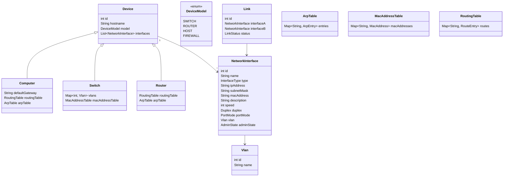

# Domain — codelab-network-engine

Documentação da camada de domínio (`com.codelab.networkengine.domain`), que modela os dispositivos de rede, suas portas e tabelas de estado para o simulador estilo Cisco/SwitchLab.

## Princípios de design

- **Playground livre**: topologia sem catálogo fixo de hardware. O aluno adiciona dispositivos e portas livremente; o número de interfaces não é limitado por um modelo de aparelho.
- **`DeviceModel` é cosmético**: apenas dá identidade/sabor ao CLI (`displayName`, sufixo de porta sugerido). Não define inventário de portas.
- **Separação L2/L3 correta**: `Switch` (L2) carrega MAC table + VLANS; `Router`/`Computer` (L3) carregam ARP + routing table.
- **Modelagem em tabelas**: objetos espelham os "show commands" do Cisco (`show mac address-table`, `show ip arp`, `show ip route`).
- **Estado administrativo vs operacional**: `AdminState` vive na interface; `LinkStatus` (up/down operacional) vive no `Link`. O "connected" é derivado do `Link`, não armazenado na porta.
- **IDs inteiros (`int`)**: simulador nunca alcançará bilhões de ids.

## Diagrama de classes

## Classes

### `Device` (abstrata)
Base de todos os dispositivos.

| Campo | Tipo | Descrição |
|---|---|---|
| `id` | `int` | Identificador único |
| `hostname` | `String` | Nome do dispositivo |
| `model` | `DeviceModel` | Rótulo cosmético do aparelho (sabor no CLI) |
| `interfaces` | `List<NetworkInterface>` | Portas do dispositivo (playground livre) |

### `DeviceModel` (enum)
Identidade/sabor do aparelho, sem limitar topologia.

| Valor | `displayName` | `defaultPortPrefix` |
|---|---|---|
| `SWITCH` | Switch 2960 | `fa` |
| `ROUTER` | Router 1941 | `gi` |
| `HOST` | Host Padrão | `eth` |
| `FIREWALL` | ASA 5505 | `gi` |

### `Computer extends Device`
Host final (L3).

| Campo | Tipo | Descrição |
|---|---|---|
| `defaultGateway` | `String` | IP do gateway padrão |
| `routingTable` | `RoutingTable` | Tabela de roteamento do host |
| `arpTable` | `ArpTable` | Cache ARP |

### `Switch extends Device`
Dispositivo de camada 2.

| Campo | Tipo | Descrição |
|---|---|---|
| `vlans` | `Map<Integer, Vlan>` | VLANS por id |
| `macAddressTable` | `MacAddressTable` | Tabela de aprendizado de MACs |

### `Router extends Device`
Roteador (L3). Simétrico ao `Computer`: para encaminhar entre redes, resolve o next-hop via ARP.

| Campo | Tipo | Descrição |
|---|---|---|
| `routingTable` | `RoutingTable` | Tabela de roteamento |
| `arpTable` | `ArpTable` | Cache ARP por interface de saída |

### `NetworkInterface`
Abstração de porta. Sustenta os exercícios de configuração no CLI.

| Campo | Tipo | Descrição |
|---|---|---|
| `id` | `int` | Identificador único |
| `name` | `String` | Nome da porta (ex.: `fa0/1`, `gi0/24`, `se0/1/0`) |
| `type` | `InterfaceType` | `ETHERNET`, `FAST_ETHERNET`, `GIGABIT_ETHERNET`, `SERIAL`, `LOOPBACK` |
| `ipAddress` | `String` | Endereço IPv4 |
| `subnetMask` | `String` | Máscara de sub-rede |
| `macAddress` | `String` | Endereço MAC |
| `description` | `String` | Descrição (comando `description` do Cisco) |
| `speed` | `int` | Velocidade em Mbps |
| `duplex` | `Duplex` | `FULL`, `HALF` |
| `portMode` | `PortMode` | Modo da porta em switch: `ACCESS`, `TRUNK` |
| `vlan` | `Vlan` | VLAN de acesso da porta |
| `adminState` | `AdminState` | `UP`/`DOWN` (representa `no shutdown`/`shutdown`) |

> O estado de enlace (`connected`) NÃO é campo da porta: é derivado do `Link` + `AdminState`.

### `Vlan`
| Campo | Tipo | Descrição |
|---|---|---|
| `id` | `int` | Identificador da VLAN |
| `name` | `String` | Nome (ex.: "VLAN10") |

### `Link`
Conexão física entre duas portas. É a única fonte do estado operacional do enlace.

| Campo | Tipo | Descrição |
|---|---|---|
| `id` | `int` | Identificador único |
| `interfaceA` | `NetworkInterface` | Porta de uma ponta |
| `interfaceB` | `NetworkInterface` | Porta da outra ponta |
| `status` | `LinkStatus` | `UP`/`DOWN` (protocolo de linha) |

## Tabelas de estado

### `ArpTable`
Mapeia IP → MAC. A **chave do Map é o IP**; o valor carrega o MAC e metadados.

| Campo (entrada) | Tipo | Descrição |
|---|---|---|
| `macAddress` | `String` | MAC resolvido |
| `interfaceName` | `String` | Interface de saída |
| `timestamp` | `LocalDateTime` | Hora da entrada (base para expiração/TTL) |
| `type` | `ArpEntryType` | `DYNAMIC`, `STATIC` |

### `MacAddressTable`
Tabela de aprendizado L2 do switch. A **chave é o MAC** aprendido.

| Campo (entrada) | Tipo | Descrição |
|---|---|---|
| `macAddress` | `String` | MAC aprendido |
| `interfaceName` | `String` | Porta de destino do quadro |
| `vlan` | `Vlan` | VLAN da entrada |
| `timestamp` | `LocalDateTime` | Hora do aprendizado (aging) |
| `type` | `MacEntryType` | `DYNAMIC`, `STATIC` |

### `RoutingTable`
Tabela de roteamento. A **chave é a rede destino** (ex.: `192.168.1.0`).

| Campo (entrada) | Tipo | Descrição |
|---|---|---|
| `subnetMask` | `String` | Máscara da rota |
| `nextHop` | `String` | Próximo salto (nulo para rotas diretamente conexas) |
| `interfaceName` | `String` | Interface de saída |
| `metric` | `int` | Métrica (distância administrativa) |
| `type` | `RouteType` | `CONNECTED`, `STATIC`, `RIP`, `OSPF`, `EIGRP` |

Métodos auxiliares: `isDirectlyConnected()` — verdadeiro quando `type == CONNECTED`.

## Próximos passos (fora do domain)

- `protocols/{arp,icmp,switching,routing}` — comportamento: aprender MAC, resolver ARP, longest-prefix-match, encaminhamento.
- `simulation/` — orquestrar sessões de topologia e o loop de pacotes.
- `cli/` — parser/registro de comandos estilo Cisco sobre o domain.
- `persistence/` — gravar exercícios e topologias.